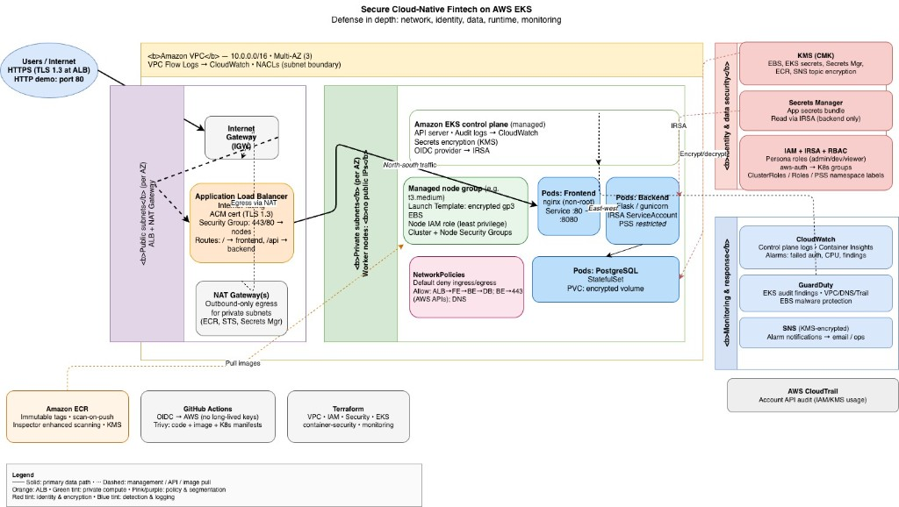

# Technical Report: Secure Cloud-Native Application Deployment on AWS EKS

**Course**: CS581 — Cloud Security
**Project**: Signature Project — Design, Implementation, and Security Hardening of a Cloud-Native Fintech Application on AWS EKS

---

## Executive Summary

This project delivers a production-grade, secure deployment of a multi-tier fintech web application on Amazon EKS. The architecture applies defense-in-depth across seven security domains — network, identity, data, container, runtime, monitoring, and incident response — and is fully reproducible via Infrastructure as Code.

The implementation includes:

- A hardened AWS network (VPC with public/private subnet separation, NAT egress, restrictive Security Groups and NACLs, and VPC Flow Logs)
- An EKS cluster with control plane audit logging, KMS-encrypted secrets, and managed node groups in private subnets
- Least-privilege AWS IAM roles for cluster infrastructure, worker nodes, pod workloads (IRSA), and three human-user personas (admin, developer, viewer)
- Kubernetes RBAC with namespace isolation and Pod Security Standards (restricted profile)
- Encrypted data at rest (KMS on EBS, EKS secrets, Secrets Manager, ECR) and in transit (TLS 1.3 via ACM on the ALB)
- ECR with immutable tags, scan-on-push, and Amazon Inspector enhanced scanning
- Trivy CI/CD scanning of source, container images, and Kubernetes manifests
- GuardDuty with EKS audit-log monitoring, CloudWatch Container Insights, and alarms routed to SNS
- Three validated threat-simulation scenarios demonstrating the controls work end to end

All infrastructure is provisioned by Terraform and all workloads by Kubernetes manifests, with GitHub Actions orchestrating image builds and vulnerability scanning. The entire system can be deployed or destroyed in approximately 20 minutes.

---

## 1. Architecture Design and Justification

### 1.1 System Context

A fintech startup requires a cloud-native web application that:

- Handles sensitive user and transaction data
- Deploys to AWS EKS
- Resists common cloud and container threats
- Complies with foundational security controls: least privilege, encryption, auditability, and incident response

### 1.2 Architecture Overview

The solution is organized in three conceptual planes:

1. **Network plane** — A single-region VPC (`10.0.0.0/16`) spread across three Availability Zones with paired public/private subnets. Public subnets host the ALB and NAT gateways; private subnets host EKS worker nodes and the EKS-managed control plane ENIs.
2. **Compute plane** — EKS managed node group (2–4 × t3.medium) running in private subnets. All pods are scheduled here; no pod is ever scheduled in a public subnet.
3. **Security and observability plane** — IAM (roles and IRSA), KMS (customer-managed keys), Secrets Manager, CloudWatch Logs, GuardDuty, and SNS are layered on top.

### 1.3 Design Decisions and Security Justification

| Decision | Alternative Considered | Security Rationale |
|----------|----------------------|-------------------|
| EKS nodes in private subnets only | Nodes in public subnets | Nodes have no public IPs; inbound traffic terminates at the ALB. Eliminates direct node exposure. |
| Multi-AZ VPC (3 AZs) | Single AZ | High availability; AZ outage does not take down the app. |
| NAT Gateway (public subnets) | Public nodes for egress | Nodes reach AWS APIs (ECR, STS, Secrets Manager) without being reachable from the Internet. |
| Customer-managed KMS key | AWS-managed keys | Full control over key policy, rotation, and access audit. |
| Managed node group with Launch Template | Self-managed EC2 | EKS owns lifecycle (upgrades, AMI patching). Launch Template lets us enforce encrypted EBS and custom security groups. |
| IRSA for pod workloads | Instance profile inheritance | Per-pod AWS permissions via OIDC — no shared credentials, no static keys. |
| Three RBAC personas (admin/dev/viewer) | Single developer role | Matches real-world separation of duties. Audit trail includes the specific role used. |
| Pod Security Standard `restricted` | `baseline` or no PSS | Blocks privileged pods, host namespace use, and capability additions at admission. |
| ALB Ingress with ACM TLS 1.3 | Self-signed or cert-manager | AWS-managed certs, automatic rotation, ELBSecurityPolicy-TLS13-1-2-2021-06 enforces modern ciphers. |
| Immutable ECR image tags | Mutable tags | Deployed image contents cannot change under the running pod. |
| GuardDuty with EKS audit log monitoring | VPC Flow Logs review only | Automated, continuous analysis versus manual forensics. |
| Terraform for all infrastructure | Click-ops / eksctl | Reviewable, reproducible, diffable changes. Drift detection via `terraform plan`. |

### 1.4 Threat Model Summary

Using STRIDE against the system:

| Threat | Affected Component | Control |
|--------|-------------------|---------|
| **S**poofing user identity | API access | IAM role authentication + Kubernetes RBAC groups |
| **T**ampering with data in transit | Client ↔ ALB ↔ pod | TLS 1.3 at ALB; in-cluster TLS for kubelet/API |
| **T**ampering with data at rest | EBS, Secrets Manager, ECR | KMS encryption on all three |
| **R**epudiation | Any admin action | CloudTrail (AWS) + EKS audit log (K8s) |
| **I**nformation disclosure | Secret material | Secrets Manager with IRSA, no secrets in images or manifests |
| **D**enial of service | ALB / nodes | ALB WAF-ready; HPA-ready node group; resource quotas on pods |
| **E**levation of privilege | Pod → host, user → admin | PSS `restricted`, RBAC least privilege, `readOnlyRootFilesystem` |

---

## 2. Implementation Summary (AWS + Kubernetes)

### 2.1 Infrastructure (Terraform)

Six Terraform modules, each with a single responsibility:

| Module | Resources |
|--------|-----------|
| `vpc` | VPC, 6 subnets, IGW, 3 NAT GWs, route tables, VPC Flow Logs + CloudWatch log group |
| `iam` | Cluster role, node role, OIDC provider prerequisites, three RBAC-persona roles (admin/dev/viewer), `eks:DescribeCluster` policy |
| `security` | EKS cluster SG, node SG, NACLs, customer-managed KMS key + alias |
| `eks` | EKS cluster (with encryption config), managed node group, launch template (encrypted gp3 EBS), OIDC provider, CloudWatch log group for control plane logs |
| `container-security` | ECR repos (frontend, backend) with `IMMUTABLE` tags, `scan_on_push`, KMS encryption, Enhanced Scanning registry config, lifecycle policies |
| `monitoring` | GuardDuty detector with EKS audit-log + EBS malware scanning, SNS alarm topic (KMS-encrypted), CloudWatch alarms (failed auth, node CPU, new GuardDuty findings), Container Insights add-on |

The root module also provisions:

- `aws_secretsmanager_secret` for backend app secrets (KMS-encrypted, 7-day recovery window)
- IRSA role for the backend ServiceAccount (`system:serviceaccount:fintech-app:app-backend`) with a narrowly scoped policy (Secrets Manager Get/Describe on one ARN, KMS Decrypt on one key)

### 2.2 Kubernetes Workloads

| Resource Type | Manifest | Purpose |
|---------------|----------|---------|
| Namespace | `namespaces/namespaces.yaml` | `fintech-app` (PSS `restricted`), `monitoring` (PSS `baseline`) |
| ClusterRole | `rbac/cluster-roles.yaml` | `cluster-admin-role`, `developer-role`, `viewer-role` |
| Role | `rbac/app-roles.yaml` | `app-deployer`, `app-viewer`, `monitoring-operator` |
| Bindings | `rbac/role-bindings.yaml` | Group → role (cluster-wide + namespaced) |
| ConfigMap | `rbac/aws-auth-configmap.yaml` | IAM role ARN → K8s group |
| ServiceAccount | `rbac/service-accounts.yaml` | `app-backend` (IRSA) and `app-frontend` (no IRSA) |
| Deployment | `deployments/backend.yaml` | 2× Flask backend, non-root UID 1000, read-only root FS |
| Deployment | `deployments/frontend.yaml` | 2× nginx-unprivileged, non-root UID 101, listens on 8080 |
| StatefulSet | `deployments/postgres.yaml` | Single replica, non-root UID 999, encrypted gp3 volume |
| Services | `services/services.yaml` | All ClusterIP (internal); database is a headless service |
| Ingress | `ingress/app-ingress-acm.yaml` | ALB with ACM TLS 1.3, SSL redirect, routes `/api` → backend and `/` → frontend |
| NetworkPolicy | `network-policies/deny-all.yaml` | Default deny ingress + egress, allow DNS egress |
| NetworkPolicy | `network-policies/frontend-policy.yaml` | Frontend ← ALB, Frontend → backend (5000) |
| NetworkPolicy | `network-policies/backend-policy.yaml` | Backend ← frontend; backend → DB (5432) + AWS APIs (443); DB ← backend only |

### 2.3 CI/CD

GitHub Actions workflows under `.github/workflows/`:

- `trivy-scan.yml` — filesystem, container-image, and K8s-config scans on every PR; results uploaded as SARIF to GitHub Code Scanning.
- `build-and-push.yml` — on push to `main`, authenticates to AWS via OIDC (no long-lived keys), builds images, enforces a final CRITICAL-severity Trivy gate, and pushes to ECR.

### 2.4 Application

The project includes a real multi-tier app implementing authentication, transaction CRUD, and dashboard views:

- **Backend** — Flask + SQLAlchemy + Flask-JWT-Extended, reads config from environment or AWS Secrets Manager via IRSA
- **Frontend** — React 18 + Vite SPA with protected routes, served by nginx
- **Database** — PostgreSQL 16-alpine

---

## 3. Security Controls Implemented

### 3.1 Network Security (Phase 5)

- **VPC segmentation**: public subnets (ALB, NAT) vs private subnets (nodes, control plane). Nodes have no public IPs.
- **Security Groups**: cluster SG allows only control-plane traffic; node SG allows only cluster ↔ node and ALB ↔ node.
- **NACLs**: stateless defense in depth at the subnet boundary.
- **VPC Flow Logs**: every packet's metadata → CloudWatch, encrypted.
- **Network Policies**: default deny-all ingress and egress in `fintech-app`, with explicit allow rules for frontend → backend → DB and backend → AWS APIs. DNS egress allowed namespace-wide to `kube-system/kube-dns`.

### 3.2 Identity & Access (Phase 4)

- **AWS IAM least privilege**: cluster role = `AmazonEKSClusterPolicy` + `AmazonEKSVPCResourceController`. Node role = worker + CNI + ECR read-only. Persona roles = `eks:DescribeCluster` only.
- **IRSA**: backend ServiceAccount assumes a role with a trust policy scoped to exactly one OIDC subject (`system:serviceaccount:fintech-app:app-backend`). The role policy allows only `secretsmanager:Get/DescribeSecret` on one ARN and `kms:Decrypt` on one key.
- **Kubernetes RBAC**: three ClusterRoles + three namespaced Roles; destructive actions (delete, exec on RBAC objects) are forbidden to developers and viewers.
- **`aws-auth` ConfigMap**: explicit IAM ARN → K8s group mapping. Node group mapping preserved; human users have no mapping by default.

### 3.3 Data Security (Phase 6)

- **At rest**: KMS customer-managed key encrypts EKS secrets, EBS volumes, Secrets Manager, ECR, and the SNS topic.
- **In transit**: ALB serves TLS 1.3 with `ELBSecurityPolicy-TLS13-1-2-2021-06`; SSL redirect forces all HTTP to HTTPS. In-cluster traffic uses kubelet's TLS.
- **Secrets**: backend pulls the `fintech-secure-dev-backend` Secrets Manager bundle via IRSA on startup. No secrets live in manifests, env vars, or images.

### 3.4 Container Security (Phase 7)

- **Build time**: multi-stage Dockerfiles, minimal slim/alpine bases, dedicated non-root users.
- **Registry**: ECR with immutable tags, KMS encryption, scan-on-push, and Inspector enhanced continuous scanning.
- **CI/CD**: Trivy scans source, images, and manifests; pipeline fails on unfixed HIGH/CRITICAL CVEs.
- **Runtime**: Pod Security Standard `restricted` at the namespace; every pod sets `runAsNonRoot`, `readOnlyRootFilesystem`, `allowPrivilegeEscalation: false`, drops ALL capabilities, uses `RuntimeDefault` seccomp.

### 3.5 Monitoring & Incident Response (Phase 8)

- **Logs**: EKS control plane (api, audit, authenticator, controllerManager, scheduler) + VPC Flow Logs + Container Insights, all retained 30 days in CloudWatch.
- **Threat detection**: GuardDuty with EKS audit-log analysis, EBS malware scanning, and DNS/VPC/CloudTrail anomaly detection.
- **Alerting**: three CloudWatch alarms → SNS (KMS-encrypted) → email subscription, covering failed API authentication, node CPU exhaustion, and new GuardDuty findings.
- **Runbook**: `docs/phase9-threat-simulation.md` documents incident-response steps for each scenario.

---

## 4. Threat Detection and Mitigation

Three attack scenarios were executed against the deployed cluster to validate the controls end to end (full transcripts in `docs/phase9-threat-simulation.md` and `docs/eks_security_report_final.pdf`).

### 4.1 Scenario 1 — Unauthorized API Access
A compromised `viewer` IAM role attempts `kubectl delete deployment`. **Blocked synchronously** by Kubernetes RBAC with a 403 Forbidden; the denial is captured in the EKS audit log. If more than 10 such denials occur in 5 minutes the `failed-auth` CloudWatch alarm fires.

### 4.2 Scenario 2 — Privilege Escalation via Privileged Pod
A malicious manifest attempts to create a pod with `privileged: true`, `hostPID`, `hostNetwork`, and `SYS_ADMIN`. **Blocked at admission** by Pod Security Standards with a detailed violation message enumerating every policy the pod breaks. No pod object is created.

### 4.3 Scenario 3 — Root Credential Usage
An administrator issues API calls using AWS root credentials. GuardDuty raises a `Policy:IAMUser/RootCredentialUsage` finding within minutes; the `guardduty-findings` alarm fires and emails the on-call address.

All three scenarios demonstrated defense in depth: scenarios 1 and 2 were prevented by synchronous controls, and scenario 3 was detected and escalated by asynchronous monitoring.

---

## 5. Evaluation Against Project Requirements

| Requirement | Evidence |
|-------------|----------|
| VPC with public/private subnets | `terraform/modules/vpc/` |
| EKS with managed node groups | `terraform/modules/eks/` |
| Terraform for all infra | 6 Terraform modules + root |
| Multi-tier K8s app (frontend + backend + DB) | `kubernetes/deployments/` |
| IAM least privilege + IRSA | `terraform/modules/iam/` + root `main.tf` |
| Kubernetes RBAC | `kubernetes/rbac/` |
| Security Groups + NACLs + private subnets | `terraform/modules/security/` |
| Network Policies | `kubernetes/network-policies/` |
| Data encryption at rest | KMS on EBS, EKS secrets, Secrets Manager, ECR, SNS |
| TLS in transit | ALB + ACM with TLS 1.3 policy |
| Secrets Manager | `aws_secretsmanager_secret` + IRSA policy |
| Image scanning (ECR + Trivy) | `terraform/modules/container-security/` + `.github/workflows/` |
| Non-root containers, minimal base | Hardened Dockerfiles + `securityContext` |
| Pod Security Standards | `fintech-app` namespace labels |
| CloudWatch logs + Kubernetes audit logs | EKS cluster logging + `/aws/eks/.../cluster` log group |
| GuardDuty | `terraform/modules/monitoring/` |
| Prometheus + Grafana (optional) | `kubernetes/monitoring/prometheus-values.yaml` |
| ≥ 2 threat simulations | 3 scenarios documented with transcripts |
| Incident response documentation | Each Phase 9 scenario has an IR section |

---

## 6. Lessons Learned

1. **Defense in depth is non-negotiable.** No single control blocked every attack in Phase 9. RBAC blocked the unauthorized action, PSS blocked the privileged pod, and GuardDuty caught the misconfiguration. Remove any one of those layers and a realistic attacker gets further.

2. **IRSA is the correct answer to "how do pods get AWS access."** Every alternative (instance profiles, static keys, shared roles) either violates least privilege or creates credential-rotation pain. The one-time cost of wiring OIDC pays back immediately.

3. **Immutable tags + continuous scanning beats tag discipline.** Early iterations mutated `:latest` and relied on developers remembering to re-scan. Immutable tags and Enhanced Scanning made "the image running in prod" and "the image we scanned" mathematically the same thing.

4. **Pod Security Standards are a better default than PSP or custom admission webhooks.** PSS ships with the cluster, has three clear tiers (privileged, baseline, restricted), and the violation messages point directly at the offending field. No webhook to deploy, no policy DSL to learn.

5. **Terraform modules over flat config.** Splitting the project into six modules (vpc, iam, security, eks, container-security, monitoring) made each concern reviewable in isolation. Adding Phase 7 and 8 was two new modules, not a refactor of existing code.

6. **NetworkPolicies are ingress *and* egress.** An early version only had ingress rules; the backend could still make outbound connections anywhere. Adding explicit egress rules (to DB, to AWS APIs on 443 only) closed a real lateral-movement path.

7. **Alerting is only as good as the runbook behind it.** CloudWatch firing on "10 failed auths" is noise unless someone knows what to do with it. The runbook in Phase 9 is as important as the alarm itself.

8. **Cost-discipline matters at the educational scale too.** The full stack costs ~$7/day. Keeping the cluster up 24/7 burns through project budget quickly; `terraform destroy` after each work session is the cheapest habit to form.

---

## 7. Appendix

### 7.1 File Index

- `terraform/` — All infrastructure modules and root configuration
- `kubernetes/` — All cluster-level manifests, in subdirectories matching the deployment order
- `backend/` — Flask application source + hardened Dockerfile
- `frontend/` — React application source + hardened Dockerfile
- `.github/workflows/` — CI/CD pipelines
- `docs/` — Phase-level deep dives, architecture diagram source, and this report

### 7.2 Command Reference

| Task | Command |
|------|---------|
| Provision everything | `cd terraform && terraform apply` |
| Configure kubectl | `aws eks update-kubeconfig --region us-west-2 --name fintech-secure-dev` |
| Apply all K8s manifests | `kubectl apply -R -f kubernetes/` (after substituting placeholders) |
| View audit log | `aws logs tail /aws/eks/fintech-secure-dev/cluster --since 10m` |
| List GuardDuty findings | `aws guardduty list-findings --detector-id <id>` |
| Tear down everything | `kubectl delete -R -f kubernetes/ && cd terraform && terraform destroy` |

### 7.3 References

- AWS EKS Best Practices Guide — https://aws.github.io/aws-eks-best-practices/
- Kubernetes Pod Security Standards — https://kubernetes.io/docs/concepts/security/pod-security-standards/
- CIS Amazon EKS Benchmark v1.5
- NIST SP 800-190 (Application Container Security Guide)
- OWASP Kubernetes Top 10
